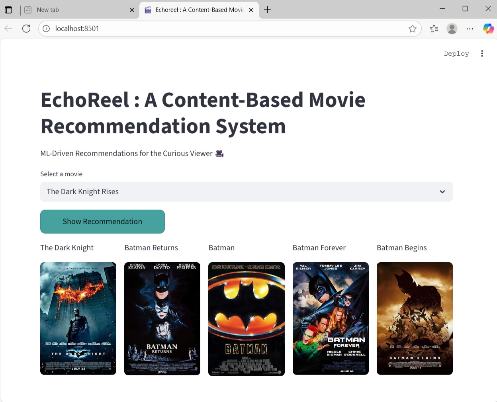
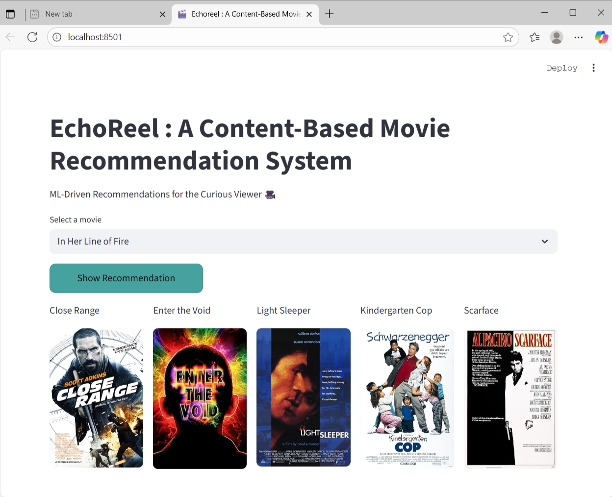

🎬 EchoReel : A Content-Based Movie Recommendation System

“Discover your next favorite movie — powered by Machine Learning.”

🌟 Overview

EchoReel is an ML-based Content-Based Movie Recommendation System that suggests movies similar to the one you select, based on their content features such as genres, keywords, and descriptions.
It is deployed as a Streamlit web app with real-time poster fetching from the OMDb API.

🧠 Types of Recommendation Systems
🔹 Content-Based Filtering

Uses attributes like genres, cast, and descriptions to recommend similar movies.
Examples → YouTube, Spotify

🔹 Collaborative Filtering

Uses user-item interactions and similarity between users.
Examples → Netflix, Amazon

🔹 Hybrid Systems

Combines both approaches to overcome their individual limitations.

🗂️ Dataset

🗂️ Dataset

This project uses the TMDB 5000 Movie Dataset, available publicly on Kaggle.
You can download it directly from the link below and place it inside a folder named dataset/.

📦 Download Dataset:
👉 https://www.kaggle.com/datasets/tmdb/tmdb-movie-metadata

After downloading, make sure your folder structure looks like this:

dataset/
├── tmdb_5000_movies.csv
└── tmdb_5000_credits.csv

🧰 Tech Stack
Category	Tools / Libraries
Frontend/UI	Streamlit, HTML, CSS
Backend/ML	Python, scikit-learn, pickle
Data Processing	pandas, numpy
API	OMDb API (for movie posters)
⚙️ Project Structure
EchoReel/
│
├── app.py                                   # Main Streamlit application
├── requirements.txt                         # Required dependencies
│
├── dataset/                                 # Raw and processed data
│   ├── tmdb_5000_movies.csv
│   └── tmdb_5000_credits.csv
│
├── docs/                                    # Demo screenshots for README
│   ├── demo1.png
│   ├── demo2.png
│   └── demo3.jpeg
│
├── movies_recommender_artifacts/            # Pretrained model artifacts
│   ├── serialized_objects/
│   │   └── movie_list.pkl
│   └── trained_model/
│       └── similarity.pkl
│
└── README.md

🚀 How to Run
1️⃣ Clone the Repository
git clone https://github.com/yourusername/Echoreel.git
cd Echoreel

2️⃣ Install Requirements
pip install -r requirements.txt

3️⃣ Run the Streamlit App
streamlit run app.py

4️⃣ Open in Browser

Go to → http://localhost:8501

🔑 API Key Setup

To fetch posters:

Get your free key → [OMDb API Key](https://www.omdbapi.com/apikey.aspx)

Paste it in app.py

OMDB_API_KEY = "your_api_key_here"

💡 Working Concept: [Cosine Similarity](https://www.learndatasci.com/glossary/cosine-similarity/)

Cosine Similarity measures the angle between two feature vectors — used here to find similar movies based on their textual features.
Learn more: Cosine Similarity Explained

🎨 Demo
Movie Selected	Recommendations
Inception	Interstellar, Shutter Island, Memento, The Prestige, The Matrix

📸 Screenshots

💡 Future Scope

Add Collaborative Filtering to make it hybrid

Integrate TMDB API for higher-quality posters

Add user login and personalized watchlists

Deploy on cloud (Streamlit Cloud / Render)

👩‍💻 Author

Sneha Kumari
💼 Aspiring AI Engineer & Developer
🔗 [LinkedIn](https://www.linkedin.com/in/sneha0511/)

🔗 [GitHub](https://github.com/snehaella5)

💬 "Because every great movie deserves to echo in your reel." 🎞️
